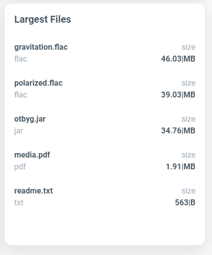

# Creation System Walkthrough

### General Information

<details>

<summary>Appwrite Requests</summary>

#### Example | Retrieve Records


```javascript
import { Client, Databases } from "appwrite";

const client = new Client();

const databases = new Databases(client);

client
    .setEndpoint('https://cloud.appwrite.io/v1') // Your API Endpoint
    .setProject('5df5acd0d48c2') // Your project ID
;

const promise = databases.getDocument('[DATABASE_ID]', '[COLLECTION_ID]', '[DOCUMENT_ID]');

promise.then(function (response) {
    console.log(response); // Success
}, function (error) {
    console.log(error); // Failure
});
```


</details>

### Dashboard

<details>

<summary>User Authentication</summary>

#### Creating a User Session | Logging In

.png>)

```javascript
function Login() {
    const client = new Client()
         .setEndpoint('http://51.161.212.158:9191/v1') // Your API Endpoint
         .setProject('64511dda13070874dfb6'); // Your project ID

    const account = new Account(client);

    let Email = document.getElementById("Email").value;
    let Pass = document.getElementById("Password").value;

    const promise = account.createEmailSession(Email, Pass);
    
    promise.then(function (response) {
         console.log(response); // Success
         window.location.href = "Dashboard.php";
    }, function (error) {
         console.log(error); // Failure
    });
}
```

This results in a session token being generated

<pre class="language-json" data-title="Session Object"><code class="lang-json">{
    "$id": "5e5ea5c16897e",
    "$createdAt": "2020-10-15T06:38:00.000+00:00",
    "userId": "5e5bb8c16897e",
    "expire": "2020-10-15T06:38:00.000+00:00",ex
    "providerUid": "user@example.com",
    <a data-footnote-ref href="#user-content-fn-1">"providerAccessToken": "MTQ0NjJkZmQ5OTM2NDE1ZTZjNGZmZjI3",</a>
    "providerAccessTokenExpiry": "2020-10-15T06:38:00.000+00:00",
    "ip": "127.0.0.1",
    "osName": "Mac",
    "clientType": "browser",
    "clientName": "Chrome Mobile iOS",
    "deviceName": "smartphone",
    "deviceBrand": "Google",
    "deviceModel": "Nexus 5",
    "countryCode": "US",
    "countryName": "United States",
    "current": true
}
</code></pre>

#### Deleting a User Session | Logging Out

.png>)

```javascript
function LogOut() {

    const client = new Client()
        .setEndpoint('http://51.161.212.158:9191/v1') // Your API Endpoint
        .setProject('64511dda13070874dfb6'); // Your project ID

    const account = new Account(client);

    const promise = account.deleteSession('current');

    promise.then(function(response) {
        console.log("  => Get LogOut: Success"); // Success
        CheckAuth();
    }, function(error) {
        console.log("  => Get LogOut: FAILED -> | " + error);
    });
}
```

#### Checking Authentication

this runs on load of any page other than Login.php \
(it checks if token is exists and valid, if not then redirects to Login.php)

```javascript
function CheckAuth() {

    const client = new Client()
        .setEndpoint('http://51.161.212.158:9191/v1') // Your API Endpoint
        .setProject('64511dda13070874dfb6'); // Your project ID

    const account = new Account(client);
    const promise = account.getSession('current');

    promise.then(function(response) {
        console.log("[!] => START <= [!]");

        console.log("  => Get CheckAuth: Success"); // Success
        GetUserName();

        setTimeout(function() {
            ListBuckets();
            GetActions();
            LoopRequests();
        }, 1000);

    }, function(error) {
        console.log(error); // Failure

        window.location.href = "Login.php";
    });
}
```

</details>

<details>

<summary>Total Cards</summary>

.png>)

This is done by setting html to a variable (would take forever to show all cards)

```javascript
total = total + response.files.length;
document.getElementById('TotalFilesCard').innerHTML = total;

while (x <= response.files.length - 1) {
    size = size + (response.files[x].sizeOriginal) / 1000000;
    totalsize = totalsize + (response.files[x].sizeOriginal);
    x = x + 1;
}
```

</details>

<details>

<summary>Actions Table</summary>


This is done by getting all records in ActionLogs and then using a while loop to append rows to the table with the data for each file.



```javascript
let Resp = [];

function GetActions() {
    const client = new Client()
        .setEndpoint('http://51.161.212.158:9191/v1') // Your API Endpoint
        .setProject('64511dda13070874dfb6'); // Your project ID


    const databases = new Databases(client);

    let AccessOverride = AccessLevel;
    if (AccessLevel == 0) {
        AccessOverride = "2";
    }

    const promise = databases.listDocuments(
        'Dashboard',
        'ActionLog',
        [
            Query.equal('Access', [AccessLevel, AccessOverride]),
            //Query.select(['File', 'User', 'Date', 'Action', 'Response', 'Source']),
            Query.orderDesc("$createdAt")
        ]
    ).then(function(response) {
        let i = 0;
        let ActionArray = response.documents;
        let Resp = response;


        document.getElementById('ActionsTable').innerHTML = '';
        while (i <= ActionArray.length - 1 && i < 10) {
            console.log(document.getElementById('UserName').innerHTML + ' | ' + ActionArray[i].User);
            let File = ActionArray[i].File;
            let User = ActionArray[i].User;
            let Date = ActionArray[i].Date;
            let Action = ActionArray[i].Action;
            let Response = ActionArray[i].Response;
            let Source = ActionArray[i].Source;

            document.getElementById('ActionsTable').insertAdjacentHTML('beforeend',
                (`<tr>
                                        <td>` + File + `</td>
                                        <td>
                                            <div class="order-owner">
                                                
                                                <span>` + User + `</span>
                                            </div>
                                        </td>
                                        <td>` + Date + `</td>
                                        <td>
                                            <span class="action-tag ` + Action + `">
                                                ` + Action + `
                                            </span>
                                        </td>
                                        <td>
                                            <div class="action-response ` + Response + `">
                                                <div class="dot"></div>
                                                <span>` + Response + `</span>
                                            </div>
                                        </td>
                                        <td>` + Source + `</td>
                                    </tr>`)
            );
            i = i + 1
        }

        document.getElementById('TotalActionsCard').innerHTML = Resp.total;
        console.log("  => Get Actions: Success"); // Success
        console.log(Resp);

    }, function(error) {
        console.log("  => Get Actions: FAILED -> | " + error);
    });

}
```


</details>

<details>

<summary>Charts</summary>


#### File Type Chart

This is done by using the FileExtArray which was defined when getting all files in each bucket. This was done in Large FIles function (will see this code next)

```javascript
const client = new Client()
    .setEndpoint('http://51.161.212.158:9191/v1') // Your API Endpoint
    .setProject('64511dda13070874dfb6'); // Your project ID

const storage = new Storage(client);
let i = 0;
let y = 0;

document.getElementById('LargeFiles').innerHTML = '';
let FileArray = [];
let TempFileArray = [];
let FileExt = "NULL";
let colors;

while (i < BucketIDArray.length) {
    storage.listFiles(BucketIDArray[i], [Query.orderDesc("sizeOriginal")]).then(function(response) {
            FileArray = response.files;
            TempFileArray = TempFileArray.concat(response.files); // Just for Debugging (not used)
            //console.log(TempFileArray);
    }
}
```


```javascript
let extensions = ['zip', 'mov', 'ppt', 'mp3', 'doc', 'png', 'txt', 'mp4', 'exe', 'avi', 'jar', 'xls', 'xci', 'rar', 'pdf', 'docx', 'pptx', 'xlsx', 'psd', 'svg', 'eps', 'indd', 'dwg', 'dxf', 'csv', 'xml', 'json', 'html', 'css', 'js', 'php', 'cpp', 'java', 'py', 'md', 'sql', 'jpg', 'jpeg', 'gif', 'bmp', 'ico', 'tiff', 'bat', 'bin', 'bak', 'class', 'dll', 'dmg', 'iso', 'tar', 'ttf', 'woff', 'eot', 'log', 'rtf', 'wav', 'wmv', 'flv', 'swf', 'mkv', 'midi', '3gp', 'm4a', 'flac', 'aac', 'ogg', 'wma', '7z', 'deb', 'pkg', 'rpm', 'sh', 'bash', 'cs', 'go', 'pl', 'swift', 'vb', 'xhtml', 'rss', 'yaml', 'ini', 'cfg', 'reg', 'inf', 'hpp', 'hxx', 'kts', 'scala', 'groovy', 'gradle', 'cljs', 'edn', 'lua', 'rmd', 'dart', 'pas', 'f90', 'f95', 'f03', 'f08', 'asm', 'rs', 'hs', 'lhs', 'lisp', 'cl', 'jl', 'sas', 'st', 'scm', 'ss', 'rkt', 'tcl', 'vh', 'svh', 'ucf', 'qsf', 'jsf', 'bsv', 'sby', 'il', 'fsx', 'fsi', 'fsproj', 'mli', 'cmx', 'cmi', 'cmo', 'cmxa', 'cma', 'cmxs', 'cc', 'cpp', 'cxx', 'c++', 'hh', 'hpp', 'hxx', 'h++', 'tcc', 'txx'];

for (let j = 0; j < extensions.length; j++) {
    let extension = extensions[j];
    if (FileName.includes("." + extension)) {
        let index = done.indexOf("." + extension);
        if (index === -1) { // extension not found in done array
            FileExtArray.push(1); // add a new index with the value of 1
            done.push("." + extension);
            FileExt = extension;
            console.log("New Ext");
        } else { // extension found in done array
            FileExtArray[index] = FileExtArray[index] + 1;
            FileExt = extension;
        }
    }
}
```


heres the code that actually build the chart.

```javascript
function MakeExtChart(colors) {


    let extension_options = {
        series: FileExtArray,
        labels: done,
        chart: {

            type: 'donut',
            expandOnClick: true,
        },
        dataLabels: {
            enabled: true,
        },
        colors: colors,

    }


    try {
        let i = 0;
        let Valid = false;
        let count = 0;
        while (i < FileExtArray.length) {
            if (isNaN(FileExtArray[i]) == true | FileExtArray[i] == null | FileExtArray[i] == undefined) {
                Valid = false;
                console.log("Not Valid")
                console.log("Invalid | " + FileExtArray[i]);
                throw new console.error("Invalid Data");
                break;
            } else {
                Valid = true;
                console.log("Number | " + FileExtArray[i]);
                count = count + 1;
                i = i + 1;
            }
        }

        if (count == FileExtArray.length) {
            console.log("Valid")
            let extension_chart = new ApexCharts(document.querySelector("#extension-chart"), extension_options);
            extension_chart.render()
            console.log(FileExtArray)
            console.log(done)
        } else {
            console.log("Count | " + count + " | " + FileExtArray[i]);
            throw new console.error("Invalid Data");
        }
    } catch (error) {
        console.log("Caught Error")
        FileExtArray = [];
        done = [];
        BucketIDArray = [];
        FileArray = [];

        setTimeout(() => {
            ListBuckets();
        }, 1000);
    }


}
```

#### Actions Chart

Theres allot here so be patient. This is essentially done by getting all records in ActionLog where the Date attribute is within the last 7 days and then we change the dates format from ISO to yyyy-mm-dd. and then we populate the chart with it.


```javascript
let ActionLogArray = new Array;
let DateArray = new Array;

async function GetRequests(i) {

    const client = new Client()
        .setEndpoint('http://51.161.212.158:9191/v1') // Your API Endpoint
        .setProject('64511dda13070874dfb6'); // Your project ID

    let AccessOverride = AccessLevel;
    if (AccessLevel == 0) {
        AccessOverride = "2";
    }

    const databases = await new Databases(client);

    var today = new Date();
    var options = {
        year: 'numeric',
        month: 'numeric',
        day: 'numeric'
    };
    var DaysAgo = new Date(today.getTime() - (i * 24 * 60 * 60 * 1000));
    const year = DaysAgo.getFullYear();
    const dayOfWeek = new Intl.DateTimeFormat('en-US', {
        weekday: 'short'
    }).format(DaysAgo);
    const month = String(DaysAgo.getMonth() + 1).padStart(2, '0');
    const day = String(DaysAgo.getDate()).padStart(2, '0');
    var isoDate = `${year}-${month}-${day}`;
    var Day = today.getDay();


    let promise = databases.listDocuments(
        'Dashboard',
        'ActionLog',
        [
            Query.equal('Date', [isoDate]),
            Query.equal('Access', [AccessLevel, AccessOverride])
        ]);

    setTimeout(() => {
        promise.then(function(response) {
            let object = response.documents;

            setTimeout(() => {
                ActionLogArray[(7 - i)] = response.total;
                console.log('     ->', response.total, isoDate, i, object);
                DateArray[(7 - i)] = dayOfWeek;
            }, 500);


        }, function(error) {
            console.log("  => Get ActionLogs: FAILED -> | " + error);
        });
        setTimeout(() => {

        }, 500);
    }, 100);

}

async function LoopRequests() {
    let i = 7;
    while (i > -1) {
        GetRequests(i);
        i = i - 1;
    }

    setTimeout(() => {
        MakeReqChart();
        console.log('  => Get ActionLogs: Success')
    }, 1000);
}

function getRandomColor() {
    var letters = '0123456789ABCDEF';
    var color = '#';
    for (var i = 0; i < 6; i++) {
        color += letters[Math.floor(Math.random() * 16)];
    }
    return color;
}

function MakeReqChart() {
    let request_options = {
        series: [{
            data: ActionLogArray,
        }],
        colors: ['#f00690'],

        chart: {
            height: 350,
            type: 'area',

        },
        dataLabels: {
            enabled: false
        },
        stroke: {
            curve: 'smooth',

        },

        xaxis: {
            type: 'day',
            categories: DateArray,
        },

        legend: {

            position: 'top',
        }
    }

    let request_chart = new ApexCharts(document.querySelector("#request-chart"), request_options)

    setTimeout(() => {
        request_chart.render()
        console.log('  => Chart Render: Success')
    }, 1000);
}
```


</details>

<details>

<summary>Large Files</summary>



This is an extract of the important part of the process. This is done by using the files array from before and sorts them by file size and then appends the first 5 items into the HTML of the Large file list.

```javascript
if (y < 5) {
    document.getElementById('LargeFiles').insertAdjacentHTML('beforeend', '<li class="LargeFile-list-item"> <div class="item-info"> <div class="item-name"> <div class="LargeFile-name">' + FileName + '</div> <div class="text-second">' + FileExt + '</div> </div> </div> <div class="item-sale-info"> <div class="text-second">size</div> <div class="LargeFile-size">' + FileSize + SizeUnit + '</div> </div> </li>');
    let listItems = document.querySelectorAll('.LargeFile-list-item');
    let itemsArray = [];
    for (let i = 0; i < listItems.length; i++) {
        itemsArray.push(listItems[i]);
    }
    itemsArray.sort(function(a, b) {
        let aSize = parseFloat(a.querySelector('.LargeFile-size').textContent);
        let bSize = parseFloat(b.querySelector('.LargeFile-size').textContent);
        let aSizeUnit = a.querySelector('.LargeFile-size').textContent.split('|')[1];
        let bSizeUnit = b.querySelector('.LargeFile-size').textContent.split('|')[1];
        if (aSizeUnit === 'GB' && bSizeUnit !== 'GB') {
            return -1;
        }
        if (aSizeUnit === 'MB' && bSizeUnit === 'KB') {
            return -1;
        }
        if (aSizeUnit === 'MB' && bSizeUnit === 'GB') {
            return 1;
        }
        if (aSizeUnit === 'KB' && bSizeUnit === 'B') {
            return -1;
        }
        if (aSizeUnit === 'KB' && bSizeUnit === 'MB') {
            return 1;
        }
        if (aSizeUnit === 'B' && bSizeUnit !== 'B') {
            return 1;
        }
        return bSize - aSize;
    });
    let ul = document.querySelector('#LargeFiles');
    ul.innerHTML = '';
    for (let i = 0; i < itemsArray.length; i++) {
        ul.appendChild(itemsArray[i]);
    }
}
y = y + 1;
```

</details>

### Files

<details>

<summary>Get Buckets</summary>

.png>)

```php
function GetBuckets()
    {

        $client = new Client();

        $client
            ->setEndpoint('http://51.161.212.158:9191/v1') // Your API Endpoint
            ->setProject('64511dda13070874dfb6') // Your project ID
            ->setKey('95fb218c695522b2f45167e2fc2a2770238998350663d0a839af6481fb310a904a3db0a570e16651622852d3f2acf694043fc36ea528153a37dd382d919deae3e887d8b5dc9dd8fe92c1a7d67265885296987692fd732210fb6646d137d3c2dbf6d037fa7b87b8a008a715e10c781b14945c2900ecbb9602ad48521bf6c13d08') // Your secret API key
        ;

        $storage = new Storage($client);
        $result2 = $storage->listBuckets(
            [
                Query::orderAsc("name")
            ]
        );

        $result3 = json_encode($result2);
        print_r($result3);


    }
```

This is done by running the PHP function above which returns all the buckets in the system as a JSON object. Then we save that to an array and loop through it, setting the file sizes and appending each bucket to the bucket list.

```javascript
function ListBuckets() {

    var BucketArrayPHP = JSON.stringify( < ? php GetBuckets(); ? > );
    var BucketArray = JSON.parse(BucketArrayPHP);
    let i = 0;
    let total = 0;
    let totalsize = 0;

    document.getElementById('BucketTable').innerHTML = ' ';
    while (i <= BucketArray.total - 1) {
        let BucketName = BucketArray.buckets[i].name;
        let BucketID = BucketArray.buckets[i].$id;

        const client = new Client()
            .setEndpoint('http://51.161.212.158:9191/v1') // Your API Endpoint
            .setProject('64511dda13070874dfb6'); // Your project ID

        const storage = new Storage(client);

        storage.listFiles(BucketID).then(function(response) {
            let x = 0;
            let size = 0;
            let sizeunit = "|MB";
            total = total + response.files.length;
            document.getElementById('TotalFilesCard').innerHTML = total;

            while (x <= response.files.length - 1) {
                size = size + response.files[x].sizeOriginal;
                totalsize = totalsize + (response.files[x].sizeOriginal);
                x = x + 1;
            }

            // Calculate the size in appropriate units
            let FileSize = 0;
            let SizeUnit = "NULL";

            if (totalsize < 1024) {
                FileSize = totalsize;
                SizeUnit = "|B";
            } else if (totalsize < 1048576) {
                FileSize = (totalsize / 1024).toFixed(2);
                SizeUnit = "|KB";
            } else if (totalsize < 1073741824) {
                FileSize = (totalsize / 1048576).toFixed(2);
                SizeUnit = "|MB";
            } else if (totalsize < 1099511627776) {
                FileSize = (totalsize / 1073741824).toFixed(2);
                SizeUnit = "|GB";
            } else {
                FileSize = (totalsize / 1099511627776).toFixed(2);
                SizeUnit = "|TB";
            }

            if (size < 1024) {
                size = size;
                sizeunit = "|B";
            } else if (size < 1048576) {
                size = (size / 1024).toFixed(2);
                sizeunit = "|KB";
            } else if (size < 1073741824) {
                size = (size / 1048576).toFixed(2);
                sizeunit = "|MB";
            } else if (size < 1099511627776) {
                size = (size / 1073741824).toFixed(2);
                sizeunit = "|GB";
            } else {
                size = (size / 1099511627776).toFixed(2);
                sizeunit = "|TB";
            }

            document.getElementById('TotalSizeCard').innerHTML = FileSize + SizeUnit;

            document.getElementById('BucketTable').insertAdjacentHTML('beforeend',
                (`<tr>
                                        <td> <i class='bx bx-folder'></i> <btn onclick="GetFiles('` + BucketID + `')">` + BucketName + `</btn> </td>
                                        <td style="text-align: center;">` + response.total + `</td>
                                        <td style="text-align: right;">` + size + sizeunit + `</td>
                                    </tr>`));

            console.log("  => Get Buckets: Success"); // Success

        }, function(error) {
            console.log("  => Get Buckets: FAILED -> | " + error);
        });


        i = i + 1;
    }

}
```

</details>

<details>

<summary>Get Files</summary>

.png>)

This is done by getting all the files in each bucket by looping through the BucketArray created before and then requesting all files in each one. We then calculate the file sizes and units and then we append them to the file list. We also create the code for the buttons and then render them.

```javascript
function GetFiles(BucketID) {
    const client = new Client()
        .setEndpoint('http://51.161.212.158:9191/v1') // Your API Endpoint
        .setProject('64511dda13070874dfb6'); // Your project IDsss

    const storage = new Storage(client);

    storage.listFiles(BucketID).then(function(response) {

        let FileArray = response.files;


        let i = 0;
        document.getElementById('FileTable').innerHTML = '';
        while (i <= FileArray.length - 1) {
            let FileName = FileArray[i].name;
            let FileSize = 0;
            let FileExt = "NULL";
            let FileID = FileArray[i].$id;
            let SizeUnit = "NULL";

            if (FileArray[i].sizeOriginal < 1024) {
                FileSize = FileArray[i].sizeOriginal;
                SizeUnit = "|B";
            } else if (FileArray[i].sizeOriginal < 1048576) {
                FileSize = (FileArray[i].sizeOriginal / 1024).toFixed(2);
                SizeUnit = "|KB";
            } else if (FileArray[i].sizeOriginal < 1073741824) {
                FileSize = (FileArray[i].sizeOriginal / 1048576).toFixed(2);
                SizeUnit = "|MB";
            } else if (FileArray[i].sizeOriginal < 1099511627776) {
                FileSize = (FileArray[i].sizeOriginal / 1073741824).toFixed(2);
                SizeUnit = "|GB";
            } else {
                FileSize = (FileArray[i].sizeOriginal / 1099511627776).toFixed(2);
                SizeUnit = "|TB";
            }


            if (FileArray[i].name.includes(".exe")) {
                FileExtArray[0] = FileExtArray[0] + 1;
                FileExt = "Executable";
            } else if (FileArray[i].name.includes(".png")) {
                FileExtArray[1] = FileExtArray[1] + 1;
                FileExt = "Image File";
            }

            document.getElementById('FileTable').insertAdjacentHTML('beforeend',
                (`<tr>
                                        <td style="text-align: left;">` + FileName + `</td>
                                        <td style="text-align: center;">` + FileSize + SizeUnit + `</td>
                                        <td style="text-align: center;">` + FileExt + `</td>
                                        <td style="text-align: center;">
                                            <span class="action-tag Download">
                                            <btn onclick="Download('` + BucketID + `', '` + FileID + `', '` + FileName + `')"><i class='bx bx-download' ></i></btn>
                                            </span>
                                        </td>
                                        <td style="text-align: center;">
                                            <span class="action-tag Delete">
                                            <btn onclick="Delete('` + BucketID + `', '` + FileID + `', '` + FileName + `')"><i class='bx bx-trash' ></i></btn>
                                            </span>
                                        </td>
                                        <td style="text-align: right;">` + FileID + `</td>
                                    </tr>`));

            document.getElementById('FileHeader').innerHTML = (
                `Files
                            <input type="file" id="uploader" oninput="Upload('` + BucketID + `')" hidden />
                            <span class="action-tag Upload">
                                <span id="UploadIcon"> <label for="uploader"> <i class='bx bx-upload'></i> </label> </span>
                                <span id="UploadingIcon" hidden> <i class='bx bx-loader-alt bx-spin'></i> </span>
                                <span id="SuccessIcon" hidden> <i class='bx bx-check-circle bx-flashing'></i> </span>
                                <span id="FailedIcon" hidden> <i class='bx bx-error bx-flashing'></i> </span>
                            </span>`
            );

            i = i + 1;
        }

        console.log("  => Get Files: Success"); // Success

    }, function(error) {
        console.log("  => Get Files: FAILED -> | " + error);
    });
}
```

</details>

<details>

<summary>Download</summary>

This requests the donwload link of the file with the ID. this information ws passed in by the button we generated earlier in GetFiles. It then opens a new tab which is blank with the URL of the File download link.

```javascript
function Download(BucketID, FileID, FileName) {

    const client = new Client();

    const storage = new Storage(client);

    client
        .setEndpoint('http://51.161.212.158:9191/v1') // Your API Endpoint
        .setProject('64511dda13070874dfb6') // Your project ID
    ;

    const result = storage.getFileDownload(BucketID, FileID);

    window.open(result, '_blank');
    LogAction(FileName, 'Download', 'Success');
}
```

</details>

<details>

<summary>Upload</summary>

This does some funky stuff but its not too complicated. Essentially we open the default file picker function of your browser and then take in the file you selected. We then change the button icon to an animated loading icon. And then we create a file in the bucket using the buckets ID and the file we took in before. we then change the icon to a check mark for about 5 seconds, and then run list buckets and get files. and finally we create a log of the action.

```javascript
function Upload(BucketID) {
    let FileN = document.getElementById('uploader').files[0].name;
    const client = new Client();

    const storage = new Storage(client);

    client
        .setEndpoint('http://51.161.212.158:9191/v1') // Your API Endpoint
        .setProject('64511dda13070874dfb6') // Your project ID
    ;

    document.getElementById('UploadIcon').hidden = true;
    document.getElementById('UploadingIcon').hidden = false;

    const promise = storage.createFile(
        BucketID,
        ID.unique(),

        document.getElementById('uploader').files[0]
    );


    promise.then(function(response) {
        setTimeout(() => {
            ListBuckets();
            GetFiles(BucketID);
            LogAction(FileN, 'Upload', 'Success');
        }, 5000);

        document.getElementById('UploadingIcon').hidden = true;
        document.getElementById('SuccessIcon').hidden = false;
    }, function(error) {
        setTimeout(() => {
            console.log(error); // Failure
            ListBuckets();
            GetFiles(BucketID);
            LogAction(FileN, 'Upload', 'Failed');
        }, 5000);

        document.getElementById('UploadingIcon').hidden = true;
        document.getElementById('FailedIcon').hidden = false;
    });
}
```

</details>

<details>

<summary>Delete</summary>

To do this we just get the BucketID and Get the FileID which again was hardcoded intot he button when we generated it. Then we Simply delete the file and Log the action and refresh files.

```javascript
function Delete(BucketID, FileID, FileName) {


    const client = new Client();

    const storage = new Storage(client);

    client
        .setEndpoint('http://51.161.212.158:9191/v1') // Your API Endpoint
        .setProject('64511dda13070874dfb6') // Your project ID
    ;

    const result = storage.deleteFile(BucketID, FileID);

    console.log(result); // File URL

    result.then(function(response) {
        ListBuckets();
        GetFiles(BucketID);
        LogAction(FileName, 'Delete', 'Success');
    }, function(error) {
        console.log(error); // Failure
        ListBuckets();
        GetFiles(BucketID);
        LogAction(FileName, 'Delete', 'Failed');
    });
}
```

</details>

<details>

<summary>Log Actions</summary>

.png>)

This is done by passing in the information from the Action executed by the Actions Function and then we create a new record in the actions table with that information. Which is then pulled down by the dashboards log table.

```javascript
function LogAction(FileName, Action, Response) {

    var today = new Date();
    const year = today.getFullYear();
    const month = String(today.getMonth() + 1).padStart(2, '0');
    const day = String(today.getDate()).padStart(2, '0');
    var isoDate = `${year}-${month}-${day}`;
    let iDate = isoDate;

    const client = new Client();

    const locale = new Locale(client);

    const databases = new Databases(client);

    client
        .setEndpoint('http://51.161.212.158:9191/v1') // Your API Endpoint
        .setProject('64511dda13070874dfb6') // Your project ID
    ;

    const Lpromise = locale.get();

    Lpromise.then(function(response) {
        let Source = response.ip;

        const Apromise = databases.createDocument('Dashboard', 'ActionLog', ID.unique(), {
            "File": FileName,
            "User": CurrentUser,
            "Date": iDate,
            "Action": Action,
            "Response": Response,
            "Source": Source,
            "Access": AccessLevel,
        });

        Apromise.then(function(response) {
            console.log(response); // Success

        }, function(error) {
            console.log(error); // Failure

        });

    }, function(error) {
        console.log(error); // Failure
    });
}
```

</details>

[^1]: 
